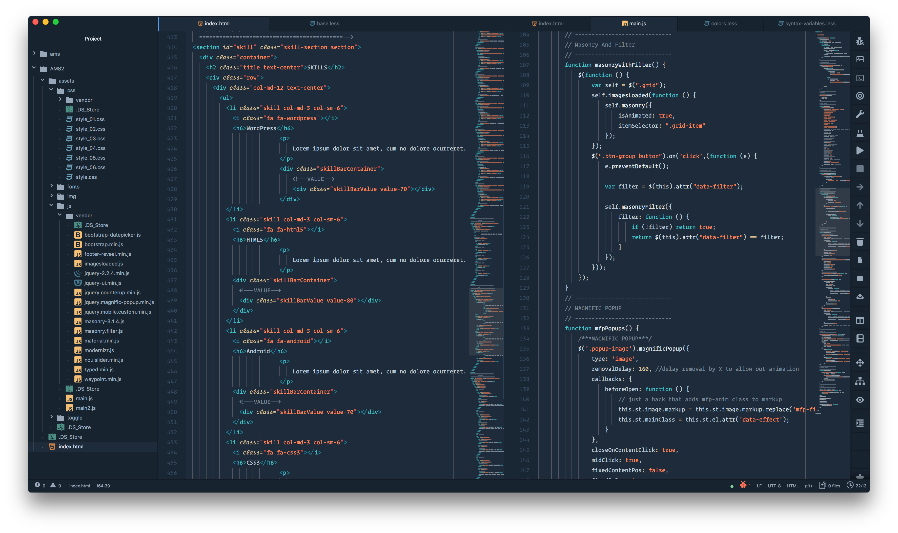
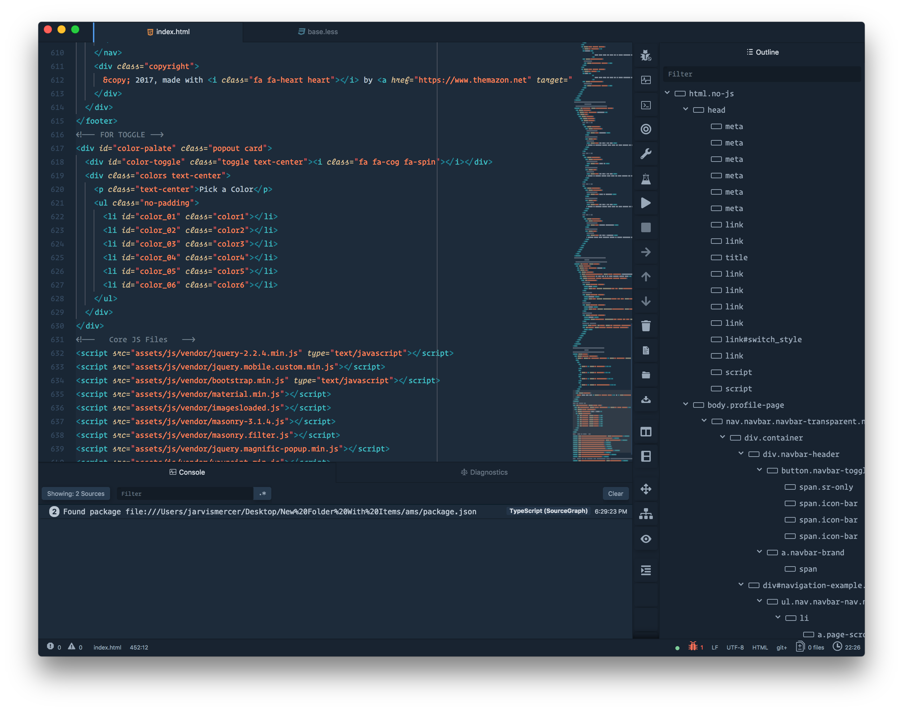

Dark Fusion Syntax
==================

Flat and color balanced dark syntax theme for maximum readability for Atom Editor

### How to install syntax theme
```bash
    apm install atom-dark-fusion-syntax
```


#### Battletested

- JavaScript
- Babel ES6 JavaScript
- CoffeeScript
- TypeScript
- Java
- Python
- Ruby **(Thanks to joseramonc)**
- Objective-C
- CSharp/Mono
- Uno/UX
- [React/JSX](https://atom.io/packages/react)
- HTML
- CSS / SASS / SCSS / Less **(Improved!)**
- JSON / CSON
- [GLSL](https://atom.io/packages/language-glsl)
- [Dot Files](https://atom.io/packages/language-dots)
- Others

---
#### JavaScript syntax (with Nucleus Dark UI)


#### HTML syntax


#### JSON syntax


---

## Changes By Me to this Syntax Theme

1. Line number more readable
2. Fonts are better visualized
3. Optimized Fonts Render
4. Better Background Color → More Readable and More Elegant
5. COMING SOON .. 😇😎


### Author

Original Developer of this theme + Me

Thanks to [MaxGraey](https://github.com/MaxGraey) for his great work

None of other them can challenge this syntax (I think 😉)

MaxGraey is my idol to developing haha

Good Luck


### New Screen Shots


>  **Atom Dark Fusion + Private UI Theme (Maybe I share it in future but You can try Nucleus Dark UI)**




